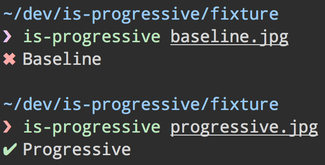

# is-progressive [](https://travis-ci.org/sindresorhus/is-progressive)

> Check if a JPEG images are [progressive](http://www.faqs.org/faqs/jpeg-faq/part1/section-11.html)

Can be useful to make sure your images are progressive, which is important for performance:

> Progressive JPEGs are better because they are faster. Appearing faster is being faster, and perceived speed is more important that actual speed. - [Progressive JPEGs: a new best practice](http://calendar.perfplanet.com/2012/progressive-jpegs-a-new-best-practice/)

The check is fast as it only reads a small part of the file.


## CLI



```
$ npm install --global is-progressive
```

```
$ is-progressive --help

  Usage
    $ is-progressive <file> ...
    $ is-progressive < <file>

  Example
    $ is-progressive baseline.jpg progressive.jpg
    ✖ baseline.jpg
    ✔ progressive.jpg
```

##### Globbing

You can use globs too, if your shell supports that.

```
$ is-progressive *.jpg
```


## Module

```
$ npm install --save is-progressive
```

```js
var isProgressive = require('is-progressive');

isProgressive.fileSync('baseline.jpg');
//=> false

isProgressive.fileSync('progressive.jpg');
//=> true
```

```js
// check if a remote JPEG image is progressive
// without downloading the whole file
var https = require('https');
var isProgressive = require('is-progressive');
var url = 'https://raw.githubusercontent.com/sindresorhus/is-progressive/master/fixture/progressive.jpg';

var req = https.get(url, function (res) {
	res.pipe(isProgressive.stream(function (progressive) {
		req.end();
		console.log(progressive);
		//=> true
	}));
});
```


### API

Prefer the file methods if you're dealing directly files as those methods are optimized to read in the least amount of bytes necessary to determine whether it's a progressive JPEG image.

#### .buffer(buffer)

Returns whether the buffer is a progressive JPEG image.

##### buffer

*Required*  
Type: `buffer`

Buffer of a JPEG image.

Must be at least `65535` bytes when the file is larger than that.

#### .stream(callback)

##### callback(progressive)

*Required*  
Type: `function`

###### progressive

Type: `boolean`

Whether the buffer is a progressive JPEG image.

#### .file(filepath, callback)

##### filepath

*Required*  
Type: `string`

Filepath to the image.

##### callback(error, progressive)

###### progressive

Type: `boolean`

Whether the buffer is a progressive JPEG.

#### .fileSync(filepath)

Returns whether the buffer is a progressive JPEG.

##### filepath

*Required*  
Type: `string`

Filepath to the image.


## Build-system integration

Don't use this with a build-system like gulp/grunt as you can easily make the images progressive with the [`imagemin`](https://github.com/imagemin/imagemin) *([gulp](https://github.com/sindresorhus/gulp-imagemin)/[grunt](https://github.com/gruntjs/grunt-contrib-imagemin)-task)* `progressive` option instead of just warning about it.


## License

MIT © [Sindre Sorhus](http://sindresorhus.com)
